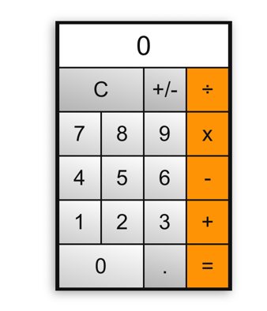

# CalculatorApp
##Test Project. Calculator with Spring, PostgreSQL, VueJs


## Frontend setup
```
npm install
```

### Compiles and hot-reloads for development
```
npm run serve
```

##Backend setup

```
mvn clean package
```

###Start app

```
java -jar target/CalculatorApp-0.0.1-SNAPSHOT.jar
```

#Design of app

